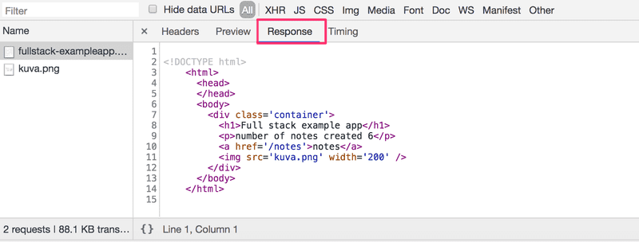
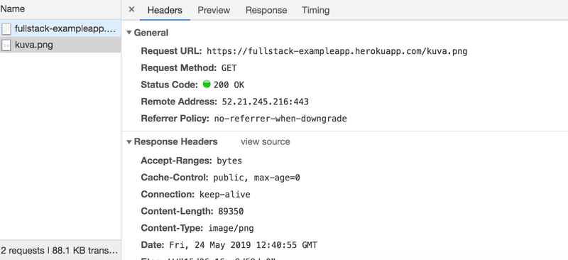
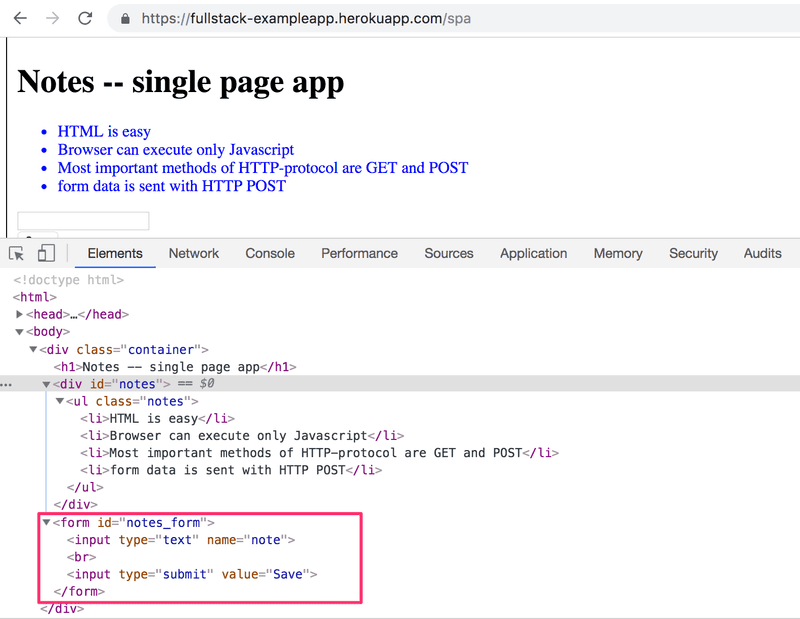

# part0 Fundamentals of Web apps
## HTTP GET
### Headers
`Content-Type: text/html; charset=utf-8`
tells us that the response is a text file in utf-8 format and the contents of which have been formatted with HTML.


### Response

Because of the ***img*** tag, the browser does a *second* HTTP request to fetch the image *kuva.png* from the server. 



## AJAX
AJAX(Asynchronous JavaScript and XML) is a technique for creating fast and dynamic web pages. AJAX allows web pages to be updated asynchronously by exchanging small amounts of data with the server behind the scenes. This means that it is possible to update parts of a web page, without reloading the whole page.

## Single Page Application
SPA-style websites don't fetch all of their pages separately from the server like our sample application does, but instead comprise only one HTML page fetched from the server, the contents of which are manipulated with JavaScript that executes in the browser.

The form has no action or method attributes to define how and where to send the input data.

The POST request to the address new_note_spa contains the new note as JSON data containing both the content of the note (content) and the timestamp (date):

```json
{
  content: "single page app does not reload the whole page",
  date: "2019-05-25T15:15:59.905Z"
}
```

The Content-Type header of the request tells the server that the included data is represented in JSON format.


## JavaScript-library
- vanilla JavaScript: only use DOM API and JavaScript
- jQuery: a JavaScript library designed to simplify HTML DOM tree traversal and manipulation, as well as event handling, CSS animation, and Ajax. It is ***cross-browser compatibility***.
- React: a JavaScript library for building user interfaces. Facebook. React can be used as a base in the development of single-page or mobile applications. It is ***component-based***.
- VueJs: has been gaining popularity in the past few years.